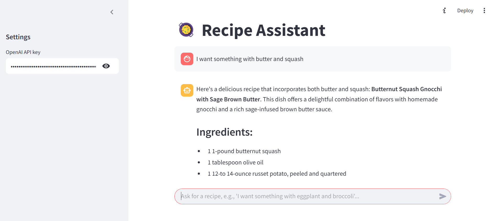

# 🥘 Recipe Assistant (RAG-based)

This project is a **Recipe Assistant** powered by **Retrieval-Augmented Generation (RAG)**. It allows users to ask for recipe suggestions in natural language, retrieves relevant recipes using semantic search (FAISS + Sentence Transformers), and uses an LLM (e.g., GPT-4o) to generate helpful responses with contextual recipe information. 

This beginner-friendly project introduces you to LLM applications using RAG with hands-on experience

---


## 📂 Project Structure

```
.
├── 13k-recipes.csv                  # Dataset of 13,000 recipes (source: https://github.com/josephrmartinez/recipe-dataset/)
├── requirements.txt                 # Python dependencies
├── fill_vector_database.py          # Script to generate and store FAISS vector index
├── streamlit_recipe_recommender.py  # Streamlit app for recipe chatbot
└── vector_store/                    # Stores FAISS index and recipe metadata (created after running the script)
```

---

## ⚙️ How It Works

### 🧠 RAG Workflow

1. **Vector Store Creation** (`fill_vector_database.py`)
   - Loads `13k-recipes.csv`.
   - Generates sentence embeddings using the [`sentence-transformers`](https://www.sbert.net/) model `all-MiniLM-L6-v2`.
   - Creates a FAISS index and saves the metadata to `vector_store/`.

2. **Chatbot UI** (`streamlit_recipe_recommender.py`)
   - Accepts user input (e.g., "something with eggplant and rice").
   - Embeds the query and retrieves top-matching recipes from the FAISS index.
   - Constructs a prompt with the retrieved recipes as context.
   - Sends the prompt to an OpenAI LLM (e.g., GPT-4o or GPT-3.5) for a final answer.
   - Displays the chat conversation using Streamlit's interactive chat UI.

---

## 🚀 Getting Started

### 1. Clone the repository

```bash
git clone https://github.com/ajayaadhikari/RAG-system-recipe-assistant.git
cd RAG-system-recipe-assistant
```

### 2. Install dependencies

```bash
pip install -r requirements.txt
```

### 3. Generate the FAISS vector database

This script encodes all recipes and creates a searchable vector index.

```bash
python fill_vector_database.py
```

✅ This will create a `vector_store/` directory with:
- `recipes.index`: FAISS vector index
- `recipes_meta.csv`: Metadata with Title, Ingredients, Instructions

### 4. Launch the Streamlit chatbot

```bash
streamlit run streamlit_recipe_recommender.py
```

---

## 🧾 Example Usage

First fill in your OpenAI key and press enter.
> **User**: I want something quick and healthy with broccoli.  
> **Assistant**: Based on your request, here's a healthy and quick recipe:  
> *Title*: Broccoli Stir Fry  
> *Ingredients*: Broccoli, garlic, soy sauce, olive oil...  
> *Instructions*: Sauté garlic, add broccoli, cook until tender, drizzle with soy sauce...

---


## 📌 Notes

- Make sure you have an OpenAI API key set via environment variable or another method for `openai` to work.
- You can modify the embedding model or LLM in the scripts as needed.
- For production use, consider persisting the FAISS index in more scalable vector stores like Pinecone or Weaviate.

---

## 📖 Acknowledgments

- [Sentence Transformers](https://www.sbert.net/)
- [FAISS by Facebook AI](https://github.com/facebookresearch/faiss)
- [Streamlit](https://streamlit.io/)
- [OpenAI API](https://platform.openai.com/)
- [13k recipies](https://github.com/josephrmartinez/recipe-dataset/)

---

Enjoy exploring and cooking new recipes! 🍽️
